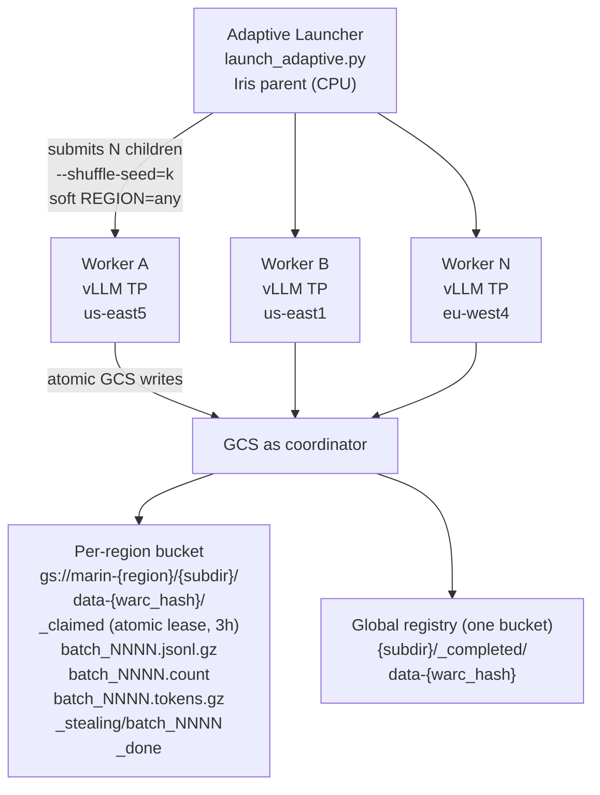

# Distributed LLM Extraction Fleet — System Overview

*Working notes for the "distributed inference" meeting — Michael Ryan, 2026-05-13.*

This is the system that currently runs Qwen3-8B over 3,000 Common Crawl WARCs
(~156M HTML records) across mixed-region preemptible TPU pools, using GCS as
its only coordinator. The point of this doc is to (a) be clear-headed about
what's actually load-bearing so we can promote the useful parts to a shared
library, and (b) surface the design questions we should resolve in the meeting.

---

## 1. What it is

A two-process system:

* **Adaptive launcher** (`experiments/baseline_collection/launch_adaptive.py`)
  — an Iris parent job that submits TPU workers in waves and only grows once
  the previous wave is fully scheduled. Pluggable child priority band.
* **Worker** (`experiments/baseline_collection/run_extract_standalone.py`)
  — one process per TPU slice (or per VM on multi-host slices). Owns a vLLM
  engine, downloads a WARC at a time from Common Crawl, claims it via GCS,
  emits per-batch checkpoints, and either finishes the WARC or, in the
  endgame, *steals* batches from in-progress WARCs.

There is no global queue, no scheduler, no central state. Workers all read the
same manifest, shuffle it with different seeds, and coordinate exclusively
through atomic GCS object writes.

---

## 2. System diagram

(Paste the block below into a Google Docs **Code Block** so monospace is
preserved; otherwise alignment will drift. If that still looks ugly, render
the Mermaid version at the end of this section into a PNG via
[mermaid.live](https://mermaid.live).)

```
                       ┌────────────────────────┐
                       │   Adaptive Launcher    │
                       │   launch_adaptive.py   │
                       │   (Iris parent, CPU)   │
                       └───────────┬────────────┘
                                   │  submits N children
                                   │  each --shuffle-seed=k
                                   │  soft REGION = any
                                   ▼
              ┌────────────────────┼────────────────────┐
              │                    │                    │
              ▼                    ▼                    ▼
        ┌───────────┐        ┌───────────┐        ┌───────────┐
        │ Worker A  │        │ Worker B  │  ...   │ Worker N  │
        │  vLLM TP  │        │  vLLM TP  │        │  vLLM TP  │
        │ us-east5  │        │ us-east1  │        │ eu-west4  │
        └─────┬─────┘        └─────┬─────┘        └─────┬─────┘
              │                    │                    │
              └────────────────────┼────────────────────┘
                                   │  coordinate exclusively
                                   │  via atomic GCS writes
                                   ▼
                       ┌────────────────────────┐
                       │   GCS as coordinator   │
                       └────────────────────────┘

GCS layout
──────────
  Per-region bucket (gs://marin-{region}/{output_subdir}/):
    data-{warc_hash}/
      _claimed                atomic lease, 3 h stale
      batch_NNNN.jsonl.gz     extraction output
      batch_NNNN.count        record-count sidecar
      batch_NNNN.tokens.gz    per-record FLOP stats
      _stealing/batch_NNNN    steal claim (endgame)
      _done                   terminal marker + stats

  Global registry (one bucket only):
    {output_subdir}/_completed/data-{warc_hash}      zero-byte marker
```

Equivalent Mermaid (paste into [mermaid.live](https://mermaid.live) for a PNG):



---

## 3. Components

The system is nine small mechanisms glued together. Each is independently
useful and several have clear analogues we could lift into a shared library.

### 3.1 Workload definition (manifest + per-VM rotation)
The manifest is a text file of S3 WARC URLs. Every worker loads the whole
list, shuffles by `--shuffle-seed`, and rotates by `IRIS_TASK_ID` so that VMs
on the same multi-host slice start in different regions of the list. Output
paths are deterministic: `data-{sha256(warc_url)[:12]}/batch_{idx:04d}.jsonl.gz`.
Deterministic naming is what lets every other mechanism work.

### 3.2 Engine (vLLM)
Single in-process vLLM `LLM` with `tensor_parallel_size=TP`, `max_model_len=32768`,
`enable_prefix_caching=True`, `temperature=0`. The engine wrapper handles three
nontrivial things: tokenizer-aware truncation to `MAX_DOC_TOKENS=26624`, chat-
template application (system message + user template + `add_generation_prompt`),
and **per-output thinking/response split** by finding the last `</think>` token
ID — used for FLOP accounting and to distinguish thinking overflow from a
genuine short answer.

### 3.3 IOContract (HTML in, JSONL out)
Forward direction: spec-driven prompt build (`extraction_template.format(example=html)`)
selected by `--spec` from `extraction_specs.py`. Reverse direction: strip
`<think>…</think>`, drop DSPy `[[ ## … ## ]]` markers, reject if cleaned text
< 50 chars or contains `[NO_USEFUL_CONTENT]`, emit `{text, generated_text, url,
warc_record_id, warc_file, snapshot}`. This is the most application-specific
layer in the whole system.

### 3.4 Per-batch checkpointing
A WARC is processed in batches of 500 records (~12 min on v5p-8). After each
batch the worker writes three files atomically: the gzipped JSONL output, a
tiny `.count` sidecar (so cross-region totals don't require decompressing
batches), and a `.tokens.gz` sidecar with per-record `{input_tokens,
thinking_tokens, response_tokens, status}` for FLOP/cost reporting. **Max work
lost on preemption: one batch.**

### 3.5 Claim system
Mutual exclusion on a WARC is a `_claimed` object in the WARC dir, written
with `if_generation_match=0`. First writer wins; everyone else gets HTTP 412.
The claim file carries `{pid, host, time, created_at}`. Two extensions:

* **Stale reclaim** — if `_claimed` is > 3 h old, a new worker can overwrite
  it using `if_generation_match=<current_generation>`; only one reclaimer wins.
* **Heartbeat** — `_refresh_claim` rewrites `time` (preserving `created_at`)
  between batches, so the 3 h stale window means "really dead", not "slow".

### 3.6 Cross-region resume
There is no single canonical bucket. Each region writes to its local bucket
(`REGION_TO_DATA_BUCKET[region]`). Before claiming, before processing each
batch, and after the run, the worker lists *all six regional buckets* for the
WARC's directory. A `_done` in any region means done; a batch file in any
region means that batch is done. This is what makes the system survive a
worker getting preempted in one region and resuming in another.

### 3.7 Cross-region tiebreak (`_should_yield_to_older_claim`)
The atomic claim only protects same-region collisions. A worker in `us-east5`
and a worker in `us-east1` can both legitimately win the local atomic write.
Between batches each worker re-reads `_claimed` in every other region; if a
*fresh* claim has an older `created_at`, the younger worker yields. Legacy
claims (no `created_at` field) are conservatively yielded to. Worst case: one
worker wastes a few batches before noticing it lost.

### 3.8 Steal mode (batch-level claims)
When most WARCs are already claimed (the endgame), workers switch into a mode
where they don't claim WARCs, they claim *batches* of in-progress WARCs from
the back. The unit is `gs://.../data-{hash}/_stealing/batch_{idx}`, again
written with `if_generation_match=0`. Stealers walk batches high → low; the
original owner walks low → high; they meet in the middle. Whichever side
writes the last batch is responsible for the `_done` marker. Patience tiers
control when to enter steal mode based on how much work is left.

### 3.9 Completion registry
A single GCS directory (`{output_subdir}/_completed/`) holds one zero-byte
marker per finished WARC (`data-{warc_hash}`). Workers list it on startup
(one API call) and every 10 WARCs to skip work that's already done elsewhere.
This is the cheap fast-path; the all-region scan from §3.6 is the
correctness fallback.

### 3.10 Adaptive launcher
The Iris parent submits an initial probe wave (default 5), polls Iris for
child states, and only grows by `chunk_size` when **all** prior children are
running. On stalls (jobs stuck pending or all children dead), it backs off
exponentially up to 30 min, then resubmits a small probe — never permanently
gives up. Children always go in at `--child-priority batch` by default; the
parent itself stays at default/interactive so the controller doesn't get
preempted and lose track of its children.

---

## 4. Invariants the system relies on

1. **Manifest → record list → batch boundaries are pure functions of the
   WARC URL and a fixed `MAX_DOC_TOKENS`.** Two workers that pick up the same
   WARC always agree on what "batch 42" means.
2. **`if_generation_match=0` is the only mutual-exclusion primitive used.**
   No leases, no locks, no service.
3. **A batch file's existence in any region implies that batch is done.**
   (No partial writes — gzip is finalized before the GCS PUT completes.)
4. **A `_done` marker implies all batches are present in some region** —
   this is enforced by re-listing every region before writing `_done`.
5. **Cost discipline is bounded by per-batch checkpoints + the completion
   registry**: preemption losses are at most one batch, and skip decisions
   are at most one list call per ~10 WARCs.

---

## 5. Measured production numbers (for context)

* Per WARC: ~54,000 records after the char-length filter, ~108 batches.
* Per batch: ~11 min warm, ~13 min cold (v5p-8, vLLM prefix cache).
* Per WARC: ~18 h on 8-chip, ~20 h on 4-chip.
* Multi-host TPUs: `TPU_PROCESS_BOUNDS=1,1,1` runs **one independent extraction
  per VM**, fully utilizing each chip; the claim system prevents duplication.

---

# Design questions for the meeting

What follows is a list of decisions we should make before this becomes a
shared library. Each is framed so attendees who haven't seen the code can
engage.

### Q1. What is the unit of work?
Today we have two units in the same system: a *shard* (WARC) for the normal
path and a *batch* for steal mode. New use cases (HF datasets, video frames,
agent rollouts) may want only the inner one. **Do we commit to a single
granularity, or build the library around nested shards from day one?**

### Q2. GCS as coordinator vs. a real coordinator?
We pay ~6 cross-region list calls per WARC and live with a 3 h stale-claim
heuristic + a `created_at` tiebreak because we don't run a coordinator
service. **Is anyone willing to own a Redis/Iris-side/Postgres coordinator for
the next 12 months?** If not, we should formalize the GCS primitives (atomic
claim, lease refresh, completion index) as first-class library API.

### Q3. Where does the engine end and the application begin?
Right now the worker does HTML truncation, chat-template formatting, and
`<think>`-token splitting in the same function as the vLLM call. **Should the
engine return structured generations (`{input_tokens, thinking_tokens,
response_tokens, finish_reason, raw_text}`) so FLOP accounting and prompt
construction generalize, or should each application reach into the tokenizer
itself?**

### Q4. Should the library know about IO format at all?
The current output schema (`text, generated_text, url, warc_record_id,
warc_file, snapshot`) is hard-coded for Common Crawl. The shared library
either ships a generic `(record) -> messages` / `(raw_output) ->
output_record_or_None` interface, or stays IO-agnostic and lets the
application supply both. **Which is the smallest committable IOContract?**

### Q5. Steal mode — keep it, or replace it with oversubscription?
Steal mode is the single most complex code path in the system. It exists to
flatten the long tail of one-WARC-stragglers in the endgame. **How much
endgame wall time does it actually save vs. just running 1.5× workers and
paying a small duplicate-compute tax?** If we don't have data, can we measure
it before committing the pattern to a library?

### Q6. Cross-region: resume, mirror, or pin?
Three credible models. (a) Status quo: workers read from any region, write to
their local region, all-region scan on every step. (b) Mirror-on-completion:
on `_done`, copy outputs to one canonical region. (c) Region pinning: every
WARC has a designated region and is never started elsewhere. Each has a
different cost profile (read-heavy vs. write-heavy vs. operational rigidity).
**Which one is the default in the shared library?**

### Q7. Adaptive launcher — does it live in this library or somewhere else?
The probe → grow → backoff loop is genuinely useful for any preemptible
fleet, not just inference. It's also entangled with Iris-specific concepts
(priority bands, soft REGION constraints, multihost env vars). **Do we ship it
here, or extract a `marin.fleet.AdaptiveController` that any workload can
use?**

### Q8. Spec registry — generic prompt-registry pattern or extraction-only?
The `--spec` mechanism gives us (a) named prompts, (b) namespaced output
paths, (c) a "bump the id if you edit the prompt" discipline, (d) parent-side
validation that fails before any TPU is requested. Items (a)–(d) are valuable
for any prompt-driven batch inference. But the namespace scheme (and the
legacy unprefixed path) is HTML-extraction-specific. **Do we promote the
pattern, the registry, or neither?**

### Q9. Batch size — workload knob, engine knob, or auto-tuned?
500 records is a number we picked empirically for Qwen3-8B on v5p-8. It's a
checkpointing knob (smaller = finer recovery), a throughput knob (vLLM's
continuous batching loves big batches), and an FLOP-accounting knob
(per-batch sidecars). **Which layer owns it, and should we auto-tune from
observed throughput?**

### Q10. What's the v0 commitment?
A concrete proposal to react to: ship `Engine` (vLLM wrapper that returns
structured generations) and `Coordinator` (GCS atomic claim + lease +
completion index) as a library; leave `Workload`, `IOContract`, and the
adaptive launcher as user code or pluggable strategies. That captures the
two pieces nobody wants to rewrite and leaves the genuinely application-
specific parts in the experiment. **Does the room agree, and what would
change your mind?**

---

## Appendix: what currently exists in marin we should be honest about

* **Ray-Data-based** `lib/marin/src/marin/generation/inference.py` — per-actor
  vLLM, batch-level granularity, no checkpoint recovery, no region awareness.
* **Zephyr-based** `lib/marin/src/marin/generation/inference_v2.py` —
  shard-level `skip_existing` checkpointing, persistent engine cache,
  no claims, no work-stealing, single-bucket output.
* **`lib/marin/src/marin/inference/vllm_server.py`** — vLLM-as-subprocess for
  evaluation. Not used by either inference path above.
* **`rigging.filesystem`** — `REGION_TO_DATA_BUCKET`, `marin_prefix()`,
  `MirrorFileSystem`, cross-region transfer budget. The Storage layer is
  already there.
* **`rigging.distributed_lock.GcsLease`** — already implements
  `if_generation_match=0` lease semantics. Our claim system reinvented this.
* **`marin.execution.executor_step_status`** — status-file + lock-file pair
  with heartbeat + stale takeover. Same shape as our claim system but for
  whole pipeline steps rather than per-shard inference.

The gap: none of the existing modules combines **multi-region resume**,
**per-shard claims with a stealing fallback**, and **per-batch checkpoints
with FLOP-accounting sidecars** in a way that survives the kind of preemption
load this fleet sees. That gap is what the shared library should close.
